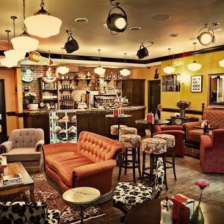
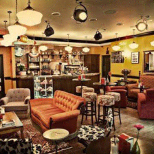

# Adversarial Attack

Attack models that are pretrained on ImageNet.

- Attack single model or multiple models.
- Apply white-box attack or black-box attack.
- Apply non-targeted attack or targeted attack.

```
https://github.com/quqixun/AdversarialAttack
```

## Methods

- White-box attack: Projected Gradient Descent<sup>[1]</sup>
- Black-box attack: Simple black-box adversarial attacks<sup>[2]</sup>

## Examples

Full examples in [example.py](./example.py).

```python
from torchvision.models import *
from attack.whitebox import WhiteBoxAttack

# Source image
src_image_path = './data/central_perk_224.png'  # label:762

# Model to be attacked
model, input_size = resnet18(pretrained=True), 224

# ----------------------------------------------------------------------------------

# White-box attack
whitebox_attack = WhiteBoxAttack(
    model=model, input_size=input_size, epsilon=16, alpha=5,
    num_iters=100, early_stopping=5, use_cuda=True
)

# Non-targeted attack
wb_nt_image = whitebox_attack(image_path=src_image_path, label=762, target=False)
# Targeted attack (label 388 for giant panda)
wb_t_image = whitebox_attack(image_path=src_image_path, label=388, target=True)

# ----------------------------------------------------------------------------------

# Black-Box Adversarial Attack on source image
blackbox_attack = BlackBoxAttack(
    model=model, input_size=input_size, epsilon=16,
    num_iters=10000, early_stopping=False, use_cuda=True, random_state=42
)

# Non-targeted attack
bb_nt_image = blackbox_attack(src_image_path, label=762, target=False)
# Targeted attack (label 388 for giant panda)
bb_t_image = blackbox_attack(src_image_path, label=388, target=True)

```

|Image|Source|Model|Attack Type|Target Type|Target Label|Output Label|Output Class|Output Confidence|
|:---:|:----:|:---:|:---------:|:---------:|:----------:|:----------:|:----------:|:---------------:|
||Yes|ResNet18|-|-|-|762|restaurant|0.957634
||No|ResNet18|White-box|Non-targeted|-|424|barbershop|0.983274|
||No|ResNet18|White-box|Targeted|388|388|giant_panda|0.999937|
||No|ResNet18|Black-box|Non-targeted|-|424|barbershop|0.538558 <br> num_iters=10000|
||No|ResNet18|Black-box|Targeted|388|388|giant_panda|0.487748 <br> num_iters=15000|

## To Do

- [ ] Implement Simba-DCT as in [1] to reduce perturbation in black-box attacks.

## References

[1] Madry A, Makelov A, Schmidt L, et al. Towards deep learning models resistant to adversarial attacks[J]. arXiv preprint arXiv:1706.06083, 2017.  
[2] Guo C, Gardner J R, You Y, et al. Simple black-box adversarial attacks[J]. arXiv preprint arXiv:1905.07121, 2019.

## Requirements

Tests are done in the environment with following packages.

|Package|Version|Is Required?|
|:-----:|:-----:|:-----:|
|pytorch|>=1.3.0|required|
|torchvision|>=0.4.2|required|
|pillow|>=6.2.0|required|
|numpy|>=1.15.4|required|
|imageio|>=2.6.1|optional|
|pretrainedmodels|>=0.7.4|optional|
